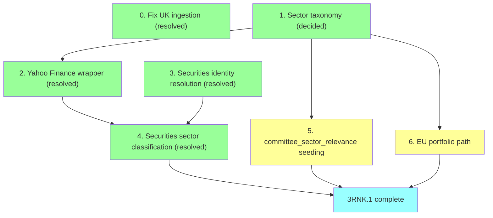

# Plan: 3RNK.1 Prerequisites

The roadmap lists `3RNK.1` as a single line — "seed `committee_sector_relevance` weights." Scoping it out surfaced a larger dependency chain: `securities` has zero rows in production, nothing populates `disclosure_events.security_id`, and EU has no committee equivalent to seed weights against at all. This doc breaks that out. Agreed to sequence this ahead of the rest of Milestone 3.

## 0. Fix UK ingestion — resolved

`disclosure_events` had 0 rows for `country = 'UK'` despite the adapter and daily cron both existing and reportedly live, while US (960 rows) and EU (40 rows) looked fine. Diagnosed against the live Parliament Interests API and the real `ingestion_runs` history, not a guess:

- **Not an adapter bug.** `CategoryId=8` (Shareholdings) is correct, the API is healthy (1,278 results across all categories for 2026), and `ingestion_runs` shows the adapter's very first run (23 Jul) correctly fetched and inserted the one real record that was in-window at the time.
- **Publishing cadence is genuinely thin**, not a symptom of anything broken: 4 Shareholdings disclosures in all of 2026 to date, 15 in all of 2025. A 40-day trailing window has real odds of going empty even with nothing wrong.
- **The actual fault: something wiped `raw_documents`/`disclosure_events` after 23 Jul**, evidenced by `ingestion_runs` recording a successful UK insert (`records_new: 1`) that no longer exists in either table, while `ingestion_runs`' own history was untouched. US/EU masked the same class of event by self-healing (US has enough volume to refill fast; EU unconditionally refetches its whole ZIP every run). UK couldn't, because the adapter only ever fetches a rolling trailing window with no backfill mode — once its one real record aged out (17 Jun + 40 days = 27 Jul), it was gone for good with no way for the adapter to ask for it again on its own.

**Fixed:**
- `FETCH_WINDOW_DAYS` widened from 40 → 90 in `lib/adapters/uk.ts` — real publishing cadence doesn't reliably fit inside 40 days, and the cost of a wider window is negligible (pagination scales with result count, not window size).
- Ran a one-off manual backfill (`PublishedFrom=2026-01-01`, through the real `runIngestion()` pipeline so it's logged in `ingestion_runs` like any other run) to recapture all 4 real 2026 records. Re-ran `seed-uk.ts` afterward to resolve `official_id` on them.

Separate, unfixed observation from the same investigation: EU's `ingestion_runs` reports `records_new: 27` on nearly every daily run, but `disclosure_events` for EU stays stable at 40 total — the `raw_documents` unique constraint is deduping correctly, but the run stats are mislabeling "fetched" as "new." Low urgency, not blocking anything here.

## 1. Sector taxonomy — decided

Use **Yahoo Finance's own sector scheme**, not GICS: `Technology, Financial Services, Healthcare, Consumer Cyclical, Consumer Defensive, Energy, Utilities, Real Estate, Basic Materials, Industrials, Communication Services`. Chosen because step 2 sources sector data from Yahoo Finance directly — adopting GICS instead would mean maintaining a permanent translation layer between Yahoo's categories and GICS's for no benefit, since nothing else in the schema assumes GICS today. This is the vocabulary `securities.sector`, `committee_sector_relevance.sector`, and `portfolio_sector_relevance.sector` must all agree on.

## 2. Yahoo Finance lookup wrapper — resolved

Built `lib/securities/yahoo-finance.ts`. The originally planned endpoint didn't survive contact with reality:

- **`quoteSummary`/`assetProfile` (what `yfinance` wraps) now rejects anonymous requests** — confirmed directly, a plain `fetch` returns `{"error":{"code":"Unauthorized","description":"Invalid Crumb"}}`. This is the exact reliability risk flagged as hypothetical when this step was first scoped, now confirmed real and current, not just a theoretical worry about the wider `yfinance` community's experience.
- **Pivoted to the `v1/finance/search` endpoint instead** — no crumb required, and it returns `sector`/`industry` inline on `EQUITY`-type results, covering both the ticker-lookup and company-name-lookup cases with one endpoint instead of two. Two exported functions: `lookupByTicker(ticker)` and `lookupByName(companyName)`.
- **Verified against five real cases**, not just the happy path: `NFLX` (clean ticker match), `AMZA` (an ETF — correctly returns `null`, since ETFs have no `sector`/`industry` fields at all, matching Peez49's own manual "Broad Market / ETF" override category), `"Erste Group AG"` (a real EU disclosure string — initial search returns nothing, because Yahoo's stored name is `"Erste Group Bank AG"`; `lookupByName` retries with the legal suffix stripped and correctly resolves to `EBS.VI`), `"Lockhouse Systems Limited"` (one of the real UK disclosures — genuinely private, correctly `null`), `"Banca Popolare di Bari"` (a real, non-private Italian bank with no Yahoo coverage — correctly `null`, distinct from the private-company case but same result, confirming a "no coverage" bucket is unavoidable and not a bug to chase).

The licensing/ToS caveat from before still stands (Yahoo's terms restrict automated access and redistribution) — treated the same as the design doc's existing unresolved **US commercial-use** and **AU/EU licensing** questions, flagged not blocking, revisit before monetization. Not reusing `Peez49/Informed-Trading`'s CSVs directly (no LICENSE file) — methodology validation only, per `docs/learnings.md`.

## 3. Securities identity resolution — resolved

Built `lib/securities/parse-security-text.ts` + `lib/securities/resolve-securities.ts`. Turned out **one shared parser covers all four sources**, not per-source variants as originally assumed — House, Senate, EU, and UK all reduce to "extract a trailing `(CODE)` group if one exists, else fall back to the full cleaned text as a name." EU/UK naturally degrade to the name-only path since they never have a trailing code at all; Senate's heavy embedded whitespace/newlines just need collapsing first, then the same end-anchored regex finds the real ticker regardless of Option/Rate-Coupon noise in between.

Real gaps designed around and confirmed on live data:
- **Ticker vs. CUSIP distinguished by shape** — 1-6 letters vs. 9-char alphanumeric-with-digits (`"US Treasury Note...(91282CGH8)"` → CUSIP, not ticker).
- **Case-only variants must dedup, substantive differences must not** — `"Madison Conn GO BD..."` / `"Madison Conn Go Bd..."` (same bond) fold to one security via a case/whitespace-normalized `name_alias`; `"US TSY NOTE 02/15/34"` / `"...02/15/35"` (different maturities) correctly stay distinct, since normalization never touches dates or coupon %.
- **Matching goes through the existing `security_identifiers` table** (`ticker`/`cusip`/`name_alias`, globally unique per type+value) rather than `securities.isin`/`primary_ticker` directly — already schema-shaped for exactly this, including the free-text case via `name_alias`.
- **Multi-leg exchanges only capture one leg** — `"BERY - ... (Exchanged) ... Amcor... (Received) (AMCR)"` resolves to `AMCR` only, `BERY` is lost. Deliberate: a two-security splitter for a pattern seen once in 120 sampled rows wasn't worth the complexity: full original text is preserved in `canonical_name` either way, so nothing is silently hidden, just not structurally split.

Ran for real: all 3,996 `disclosure_events` resolved (0 remaining `security_id IS NULL`), 1,538 distinct securities created. Verified against real data, not just row counts: 48 separate House/Senate disclosures for AAPL all resolve to one `securities` row via the `ticker` identifier; the Madison Conn bond's two case variants resolve to one row via `name_alias`.

## 4. Securities sector classification — resolved

Built `lib/securities/classify-sectors.ts`, operating over the 1,538 real `securities` rows from step 3: `lookupByTicker(primary_ticker)` where one exists, `lookupByName(canonical_name)` otherwise. Added an `industry` column alongside `sector` on `securities` (migration `20260815120516_securities_industry.sql`) while in here — the wrapper already returns it for free on every lookup, per the Peez49 learnings' "cheap to capture now, expensive to backfill later" point.

**First run confirmed the wrapper's reliability caveat directly, not hypothetically**: a raw `ECONNRESET` partway through (482/1,538 done) from hammering the search endpoint with no pacing — not a clean HTTP error, an unofficial endpoint behaving exactly as flaky as expected. Fixed properly rather than just retrying blind: retry-with-backoff added to `yahoo-finance.ts`'s `search()` (belongs in the wrapper — general resilience to transient failures), a 200ms pace between requests added to `classify-sectors.ts`'s loop (belongs in the bulk caller — only bulk callers need to be polite). Re-run completed cleanly with no further failures.

Final result: **1,101/1,538 classified (72%), 437 left `null`** — verified as the expected shape, not noise: sensible spread across all 11 Yahoo sectors (Industrials 190, Financial Services 150, Technology 149, down to Utilities 20), Netflix and Erste Group Bank AG both correctly classified, and every sampled UK private company (`Lockhouse Systems Limited`, `AccuRx Ltd`, etc.) and every US Treasury bond correctly left `null` — Treasuries don't have a meaningful equity sector to begin with, so this is the honest answer, not a gap.

## 5. `committee_sector_relevance` weight seeding

UK: 98 committees. US: 230 committees. 328 total — too many to hand-write cleanly. Do a keyword-heuristic first pass (committee name → sector) plus a manual review file, following the same "don't assume, flag it" convention as the existing unmatched-notes pattern in `seed-uk.ts`/`seed-us.ts`. Flag general-jurisdiction committees (e.g. House Appropriations) rather than letting them dilute every sector, per the Peez49 methodology.

## 6. EU portfolio path

EU has no committee structure — Commissioners hold individual portfolios instead, which the DOI declaration documents don't state anywhere (confirmed by direct inspection of all 27 documents). Needs its own structure, mirroring committees rather than reusing them (real mismatches beyond naming: portfolio is 1:1 with no role gradient vs. committee membership's many-to-many churn; `chamber NOT NULL` encodes a real legislative-chamber concept the Commission doesn't have; committee-relevance weights assume diluted/shared influence vs. a portfolio's near-exclusive authority; committee identity is stable by name for years, portfolio titles reshuffle every 5-year Commission term).

- Migrations: `portfolios` (id, title, country, external_ids), `official_portfolios` (official_id, portfolio_id, start_date, end_date — same shape as `official_committee_memberships`), `portfolio_sector_relevance` (portfolio_id, sector, weight — same shape as `committee_sector_relevance`).
- Drop `officials.current_office` — confirmed unused (never populated by any seeder, never read anywhere), and the portfolio tables now cover the one credible use case that had been proposed for it.
- Extend `seed-eu.ts`: exact full-name search against Wikidata (verified this resolves cleanly — tested von der Leyen, Kubilius) → filter `P39` ("position held") claims by label pattern (`"European Commissioner for..."`), not by missing end-date, since Wikidata's end-date qualifiers are confirmed stale/incomplete on at least one real commissioner (Kubilius still shows an open-ended "Member of the European Parliament" claim despite becoming Commissioner in Dec 2024) → upsert `portfolios` + `official_portfolios`. Cross-check against the Commission's own College of Commissioners page to catch exactly this kind of staleness.
- Seed `portfolio_sector_relevance` for 27 portfolios — much smaller effort than step 5, a good pilot before it.

## Dependencies

`0` is independent — no dependency on the rest, do it first as agreed. `3` and `5`/`6` don't depend on each other and can run in parallel once the taxonomy is fixed. `3RNK.5` (wiring `committee_sector_relevance`/`portfolio_sector_relevance` into the actual `mv_signal_scores` formula) is downstream of this doc entirely and already tracked separately on the roadmap — not repeated here.
