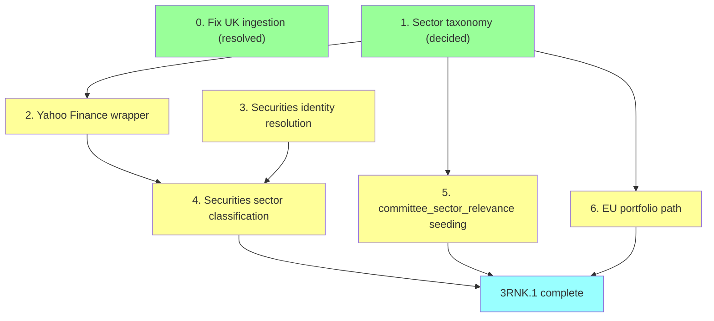

# Plan: 3RNK.1 Prerequisites

The roadmap lists `3RNK.1` as a single line — "seed `committee_sector_relevance` weights." Scoping it out surfaced a larger dependency chain: `securities` has zero rows in production, nothing populates `disclosure_events.security_id`, and EU has no committee equivalent to seed weights against at all. This doc breaks that out. Agreed to sequence this ahead of the rest of Milestone 3.

## 0. Fix UK ingestion — resolved

`disclosure_events` had 0 rows for `country = 'UK'` despite the adapter and daily cron both existing and reportedly live, while US (960 rows) and EU (40 rows) looked fine. Diagnosed against the live Parliament Interests API and the real `ingestion_runs` history, not a guess:

- **Not an adapter bug.** `CategoryId=8` (Shareholdings) is correct, the API is healthy (1,278 results across all categories for 2026), and `ingestion_runs` shows the adapter's very first run (23 Jul) correctly fetched and inserted the one real record that was in-window at the time.
- **Publishing cadence is genuinely thin**, not a symptom of anything broken: 4 Shareholdings disclosures in all of 2026 to date, 15 in all of 2025. A 40-day trailing window has real odds of going empty even with nothing wrong.
- **The actual fault: something wiped `raw_documents`/`disclosure_events` after 23 Jul**, evidenced by `ingestion_runs` recording a successful UK insert (`records_new: 1`) that no longer exists in either table, while `ingestion_runs`' own history was untouched. US/EU masked the same class of event by self-healing (US has enough volume to refill fast; EU unconditionally refetches its whole ZIP every run). UK couldn't, because the adapter only ever fetches a rolling trailing window with no backfill mode — once its one real record aged out (17 Jun + 40 days = 27 Jul), it was gone for good with no way for the adapter to ask for it again on its own.

**Fixed:**
- `FETCH_WINDOW_DAYS` widened from 40 → 90 in `lib/adapters/uk.ts` — real publishing cadence doesn't reliably fit inside 40 days, and the cost of a wider window is negligible (pagination scales with result count, not window size).
- Ran a one-off manual backfill (`PublishedFrom=2026-01-01`, through the real `runIngestion()` pipeline so it's logged in `ingestion_runs` like any other run) to recapture all 4 real 2026 records. Re-ran `seed-uk.ts` afterward to resolve `official_id` on them.

Separate, unfixed observation from the same investigation: EU's `ingestion_runs` reports `records_new: 27` on nearly every daily run, but `disclosure_events` for EU stays stable at 40 total — the `raw_documents` unique constraint is deduping correctly, but the run stats are mislabeling "fetched" as "new." Low urgency, not blocking anything here.

## 1. Sector taxonomy — decided

Use **Yahoo Finance's own sector scheme**, not GICS: `Technology, Financial Services, Healthcare, Consumer Cyclical, Consumer Defensive, Energy, Utilities, Real Estate, Basic Materials, Industrials, Communication Services`. Chosen because step 2 sources sector data from Yahoo Finance directly — adopting GICS instead would mean maintaining a permanent translation layer between Yahoo's categories and GICS's for no benefit, since nothing else in the schema assumes GICS today. This is the vocabulary `securities.sector`, `committee_sector_relevance.sector`, and `portfolio_sector_relevance.sector` must all agree on.

## 2. Yahoo Finance lookup wrapper

Build our own thin wrapper against Yahoo Finance's unofficial `quoteSummary` endpoint (`query1.finance.yahoo.com/v10/finance/quoteSummary/{ticker}?modules=assetProfile`) — free, no key, plain `fetch`, same shape as every other adapter in this codebase. Two open risks, treated the same way the design doc already treats the unresolved **US commercial-use** and **AU/EU licensing** questions — flagged, not blocking, revisit before monetization:
- **Licensing/ToS**: Yahoo's terms restrict automated access and redistribution of their data.
- **Reliability**: this is the same unofficial endpoint the wider `yfinance` Python community has repeatedly had break underneath them. Not something to build time-critical ingestion on the way the House Clerk ZIP or UK's official API are — treat as a periodic/manual backfill job, not part of the daily cron.

Not reusing `Peez49/Informed-Trading`'s pre-built CSVs (`stock_industry_classifications.csv`, `Jurisdictional_Matrix_Final.csv`) — that repo has no LICENSE file, so default copyright applies. Useful as methodology validation only (confirms both the sector-per-ticker approach and the committee-jurisdiction-mapping approach are solved problems, and that one worthwhile idea — flagging general-jurisdiction committees like House Appropriations so they don't dilute every sector — is worth carrying into step 5).

## 3. Securities identity resolution (new)

Nothing currently exists here — `securities` has 0 rows, and no adapter has ever written to it or to `disclosure_events.security_id`. Format varies significantly per source, checked against real rows:

- **US House**: mostly clean, ticker present in parens (`"Netflix, Inc. - Common Stock (NFLX)"`) — but non-equity instruments (Treasury notes, bonds) have a CUSIP-like code instead of a ticker.
- **US Senate**: inconsistent — ticker sometimes present, sometimes only a company name plus bond rate/maturity details, and exchange transactions pack two securities into one string (`"BERY - Berry Global Group, Inc. (Exchanged) ... Amcor plc Ordinary Shares (Received) (AMCR)"`).
- **EU**: pure free-text company/entity names, sometimes non-English, sometimes with editorial asides — no ticker ever.
- **UK**: unknown until step 0 produces real data to inspect.

Build a per-source parser extracting `{tickerOrIsin, canonicalName}`, upsert into `securities`, backfill `disclosure_events.security_id` — same identity-seeding shape as `seed-uk.ts`/`seed-us.ts`/`seed-eu.ts`, new domain (securities instead of officials).

## 4. Securities sector classification

Using the step 2 wrapper: ticker/ISIN → sector for US-sourced rows. EU rows have no ticker, so company-name lookup (Yahoo's `v1/finance/search` or similar) will have a lower hit rate — likely needs a small hand-authored override table given it's a bounded, small universe of companies. Populate `securities.sector`.

## 5. `committee_sector_relevance` weight seeding

UK: 98 committees. US: 230 committees. 328 total — too many to hand-write cleanly. Do a keyword-heuristic first pass (committee name → sector) plus a manual review file, following the same "don't assume, flag it" convention as the existing unmatched-notes pattern in `seed-uk.ts`/`seed-us.ts`. Flag general-jurisdiction committees (e.g. House Appropriations) rather than letting them dilute every sector, per the Peez49 methodology.

## 6. EU portfolio path

EU has no committee structure — Commissioners hold individual portfolios instead, which the DOI declaration documents don't state anywhere (confirmed by direct inspection of all 27 documents). Needs its own structure, mirroring committees rather than reusing them (real mismatches beyond naming: portfolio is 1:1 with no role gradient vs. committee membership's many-to-many churn; `chamber NOT NULL` encodes a real legislative-chamber concept the Commission doesn't have; committee-relevance weights assume diluted/shared influence vs. a portfolio's near-exclusive authority; committee identity is stable by name for years, portfolio titles reshuffle every 5-year Commission term).

- Migrations: `portfolios` (id, title, country, external_ids), `official_portfolios` (official_id, portfolio_id, start_date, end_date — same shape as `official_committee_memberships`), `portfolio_sector_relevance` (portfolio_id, sector, weight — same shape as `committee_sector_relevance`).
- Drop `officials.current_office` — confirmed unused (never populated by any seeder, never read anywhere), and the portfolio tables now cover the one credible use case that had been proposed for it.
- Extend `seed-eu.ts`: exact full-name search against Wikidata (verified this resolves cleanly — tested von der Leyen, Kubilius) → filter `P39` ("position held") claims by label pattern (`"European Commissioner for..."`), not by missing end-date, since Wikidata's end-date qualifiers are confirmed stale/incomplete on at least one real commissioner (Kubilius still shows an open-ended "Member of the European Parliament" claim despite becoming Commissioner in Dec 2024) → upsert `portfolios` + `official_portfolios`. Cross-check against the Commission's own College of Commissioners page to catch exactly this kind of staleness.
- Seed `portfolio_sector_relevance` for 27 portfolios — much smaller effort than step 5, a good pilot before it.

## Dependencies

`0` is independent — no dependency on the rest, do it first as agreed. `3` and `5`/`6` don't depend on each other and can run in parallel once the taxonomy is fixed. `3RNK.5` (wiring `committee_sector_relevance`/`portfolio_sector_relevance` into the actual `mv_signal_scores` formula) is downstream of this doc entirely and already tracked separately on the roadmap — not repeated here.
