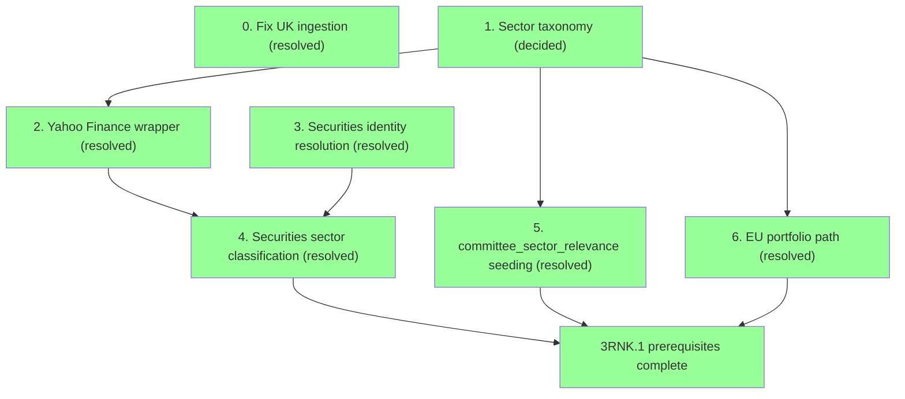

# Plan: 3RNK.1 Prerequisites

**Status: all 7 steps resolved.** The roadmap listed `3RNK.1` as a single line — "seed `committee_sector_relevance` weights." Scoping it out surfaced a larger dependency chain: `securities` had zero rows in production, nothing populated `disclosure_events.security_id`, and EU had no committee equivalent to seed weights against at all. This doc broke that out and tracked it ahead of the rest of Milestone 3.

## 0. Fix UK ingestion — resolved

`disclosure_events` had 0 rows for `country = 'UK'` despite the adapter and daily cron both existing and reportedly live, while US (960 rows) and EU (40 rows) looked fine. Diagnosed against the live Parliament Interests API and the real `ingestion_runs` history, not a guess:

- **Not an adapter bug.** `CategoryId=8` (Shareholdings) is correct, the API is healthy (1,278 results across all categories for 2026), and `ingestion_runs` shows the adapter's very first run (23 Jul) correctly fetched and inserted the one real record that was in-window at the time.
- **Publishing cadence is genuinely thin**, not a symptom of anything broken: 4 Shareholdings disclosures in all of 2026 to date, 15 in all of 2025. A 40-day trailing window has real odds of going empty even with nothing wrong.
- **The actual fault: something wiped `raw_documents`/`disclosure_events` after 23 Jul**, evidenced by `ingestion_runs` recording a successful UK insert (`records_new: 1`) that no longer exists in either table, while `ingestion_runs`' own history was untouched. US/EU masked the same class of event by self-healing (US has enough volume to refill fast; EU unconditionally refetches its whole ZIP every run). UK couldn't, because the adapter only ever fetches a rolling trailing window with no backfill mode — once its one real record aged out (17 Jun + 40 days = 27 Jul), it was gone for good with no way for the adapter to ask for it again on its own.

**Fixed:**
- `FETCH_WINDOW_DAYS` widened from 40 → 90 in `lib/adapters/uk.ts` — real publishing cadence doesn't reliably fit inside 40 days, and the cost of a wider window is negligible (pagination scales with result count, not window size).
- Ran a one-off manual backfill (`PublishedFrom=2026-01-01`, through the real `runIngestion()` pipeline so it's logged in `ingestion_runs` like any other run) to recapture all 4 real 2026 records. Re-ran `seed-uk.ts` afterward to resolve `official_id` on them.

Separate, unfixed observation from the same investigation: EU's `ingestion_runs` reports `records_new: 27` on nearly every daily run, but `disclosure_events` for EU stays stable at 40 total — the `raw_documents` unique constraint is deduping correctly, but the run stats are mislabeling "fetched" as "new." Low urgency, not blocking anything here.

## 1. Sector taxonomy — decided

Use **Yahoo Finance's own sector scheme**, not GICS: `Technology, Financial Services, Healthcare, Consumer Cyclical, Consumer Defensive, Energy, Utilities, Real Estate, Basic Materials, Industrials, Communication Services`. Chosen because step 2 sources sector data from Yahoo Finance directly — adopting GICS instead would mean maintaining a permanent translation layer between Yahoo's categories and GICS's for no benefit, since nothing else in the schema assumes GICS today. This is the vocabulary `securities.sector`, `committee_sector_relevance.sector`, and `portfolio_sector_relevance.sector` must all agree on.

## 2. Yahoo Finance lookup wrapper — resolved

Built `lib/securities/yahoo-finance.ts`. The originally planned endpoint didn't survive contact with reality:

- **`quoteSummary`/`assetProfile` (what `yfinance` wraps) now rejects anonymous requests** — confirmed directly, a plain `fetch` returns `{"error":{"code":"Unauthorized","description":"Invalid Crumb"}}`. This is the exact reliability risk flagged as hypothetical when this step was first scoped, now confirmed real and current, not just a theoretical worry about the wider `yfinance` community's experience.
- **Pivoted to the `v1/finance/search` endpoint instead** — no crumb required, and it returns `sector`/`industry` inline on `EQUITY`-type results, covering both the ticker-lookup and company-name-lookup cases with one endpoint instead of two. Two exported functions: `lookupByTicker(ticker)` and `lookupByName(companyName)`.
- **Verified against five real cases**, not just the happy path: `NFLX` (clean ticker match), `AMZA` (an ETF — correctly returns `null`, since ETFs have no `sector`/`industry` fields at all, matching Peez49's own manual "Broad Market / ETF" override category), `"Erste Group AG"` (a real EU disclosure string — initial search returns nothing, because Yahoo's stored name is `"Erste Group Bank AG"`; `lookupByName` retries with the legal suffix stripped and correctly resolves to `EBS.VI`), `"Lockhouse Systems Limited"` (one of the real UK disclosures — genuinely private, correctly `null`), `"Banca Popolare di Bari"` (a real, non-private Italian bank with no Yahoo coverage — correctly `null`, distinct from the private-company case but same result, confirming a "no coverage" bucket is unavoidable and not a bug to chase).

The licensing/ToS caveat from before still stands (Yahoo's terms restrict automated access and redistribution) — treated the same as the design doc's existing unresolved **US commercial-use** and **AU/EU licensing** questions, flagged not blocking, revisit before monetization. Not reusing `Peez49/Informed-Trading`'s CSVs directly (no LICENSE file) — methodology validation only, per `docs/learnings.md`.

## 3. Securities identity resolution — resolved

Built `lib/securities/parse-security-text.ts` + `lib/securities/resolve-securities.ts`. Turned out **one shared parser covers all four sources**, not per-source variants as originally assumed — House, Senate, EU, and UK all reduce to "extract a trailing `(CODE)` group if one exists, else fall back to the full cleaned text as a name." EU/UK naturally degrade to the name-only path since they never have a trailing code at all; Senate's heavy embedded whitespace/newlines just need collapsing first, then the same end-anchored regex finds the real ticker regardless of Option/Rate-Coupon noise in between.

Real gaps designed around and confirmed on live data:
- **Ticker vs. CUSIP distinguished by shape** — 1-6 letters vs. 9-char alphanumeric-with-digits (`"US Treasury Note...(91282CGH8)"` → CUSIP, not ticker).
- **Case-only variants must dedup, substantive differences must not** — `"Madison Conn GO BD..."` / `"Madison Conn Go Bd..."` (same bond) fold to one security via a case/whitespace-normalized `name_alias`; `"US TSY NOTE 02/15/34"` / `"...02/15/35"` (different maturities) correctly stay distinct, since normalization never touches dates or coupon %.
- **Matching goes through the existing `security_identifiers` table** (`ticker`/`cusip`/`name_alias`, globally unique per type+value) rather than `securities.isin`/`primary_ticker` directly — already schema-shaped for exactly this, including the free-text case via `name_alias`.
- **Multi-leg exchanges only capture one leg** — `"BERY - ... (Exchanged) ... Amcor... (Received) (AMCR)"` resolves to `AMCR` only, `BERY` is lost. Deliberate: a two-security splitter for a pattern seen once in 120 sampled rows wasn't worth the complexity: full original text is preserved in `canonical_name` either way, so nothing is silently hidden, just not structurally split.

Ran for real: all 3,996 `disclosure_events` resolved (0 remaining `security_id IS NULL`), 1,538 distinct securities created. Verified against real data, not just row counts: 48 separate House/Senate disclosures for AAPL all resolve to one `securities` row via the `ticker` identifier; the Madison Conn bond's two case variants resolve to one row via `name_alias`.

## 4. Securities sector classification — resolved

Built `lib/securities/classify-sectors.ts`, operating over the 1,538 real `securities` rows from step 3: `lookupByTicker(primary_ticker)` where one exists, `lookupByName(canonical_name)` otherwise. Added an `industry` column alongside `sector` on `securities` (migration `20260815120516_securities_industry.sql`) while in here — the wrapper already returns it for free on every lookup, per the Peez49 learnings' "cheap to capture now, expensive to backfill later" point.

**First run confirmed the wrapper's reliability caveat directly, not hypothetically**: a raw `ECONNRESET` partway through (482/1,538 done) from hammering the search endpoint with no pacing — not a clean HTTP error, an unofficial endpoint behaving exactly as flaky as expected. Fixed properly rather than just retrying blind: retry-with-backoff added to `yahoo-finance.ts`'s `search()` (belongs in the wrapper — general resilience to transient failures), a 200ms pace between requests added to `classify-sectors.ts`'s loop (belongs in the bulk caller — only bulk callers need to be polite). Re-run completed cleanly with no further failures.

Final result: **1,101/1,538 classified (72%), 437 left `null`** — verified as the expected shape, not noise: sensible spread across all 11 Yahoo sectors (Industrials 190, Financial Services 150, Technology 149, down to Utilities 20), Netflix and Erste Group Bank AG both correctly classified, and every sampled UK private company (`Lockhouse Systems Limited`, `AccuRx Ltd`, etc.) and every US Treasury bond correctly left `null` — Treasuries don't have a meaningful equity sector to begin with, so this is the honest answer, not a gap.

## 5. `committee_sector_relevance` weight seeding — resolved

Built `lib/committees/classify-committee.ts` (an explicit, auditable rules table rather than a black-box heuristic) + `lib/committees/seed-committee-sector-relevance.ts`. Real domain knowledge, not blind keyword matching — e.g. "Ways and Means" has zero keyword tie to tax/trade/Social Security policy, and general-jurisdiction parents (Appropriations, Energy and Commerce, Oversight) often have genuinely specific subcommittees despite the parent being broad.

**Weight is deliberately binary-with-a-secondary-tier, not fully graded**: a committee's first-listed sector gets weight `1` (primary), any additional sectors get `0.5` (secondary), and GENERAL/EXCLUDE committees get **no row at all** rather than an explicit `0` — the ranking formula's `coalesce(csr.weight, 0)` already treats an absent row as zero, so an explicit-zero row would be pure table bloat (up to 328×11 rows) for no behavioural difference. Matches Peez49's own methodology of not bothering with fine-grained weights, while still capturing the primary/secondary distinction from earlier planning.

Three real distinctions carried through explicitly, not collapsed into one bucket:
- **General jurisdiction** (e.g. House Appropriations' bare parent, UK's Business and Trade Committee) — broad, not sector-specific, but a legitimate committee.
- **Excluded** (e.g. Ethics, Intelligence, private-bill committees, internal chamber administration) — no real sector jurisdiction at all, a different judgment from "broad."
- **Classified into sectors** — the actual relevance rows.

A full audit file (`lib/committees/committee-sector-relevance-audit.md`, gitignored, regenerated on every run) lists **all 328 committees** with their classification and reasoning, not just the ones that failed to match — sector classification is editorial judgment throughout, not a factual lookup, so every call needs to be checkable, not just the uncertain ones. Caught two real regex bugs from a first run's "unclassified" bucket before trusting the output: `\bBill\b` doesn't match plural "Bills" (word boundary sits between "Bill" and "s"), and an `Education...$`/`Services Committee \(Lords\)` pattern wrongly assumed chamber text lives inside the committee name string when it's actually a separate column. Also caught a reason-text bug the audit surfaced directly: a `Digital Assets` subcommittee rule's explanation claimed "a Financial Services subcommittee" but also correctly matched an Agriculture subcommittee with real CFTC/commodity-derivatives jurisdiction — the sector call was fine, the reasoning text was misleadingly specific and got corrected.

Final result, verified against the DB directly: **217 relevance rows** (151 at weight `1`, 66 at weight `0.5`) across **151 committees classified into sectors**, 102 general jurisdiction, 75 excluded, **0 unclassified**.

## 6. EU portfolio path — resolved

EU has no committee structure — Commissioners hold individual portfolios instead, which the DOI declaration documents don't state anywhere (confirmed by direct inspection of all 27 documents). Built its own structure, mirroring committees rather than reusing them (real mismatches beyond naming: portfolio is 1:1 with no role gradient vs. committee membership's many-to-many churn; `chamber NOT NULL` encodes a real legislative-chamber concept the Commission doesn't have; committee-relevance weights assume diluted/shared influence vs. a portfolio's near-exclusive authority; committee identity is stable by name for years, portfolio titles reshuffle every 5-year Commission term).

- Migrations: `portfolios` (id, title, country, external_ids), `official_portfolios` (official_id, portfolio_id, start_date, end_date — same shape as `official_committee_memberships`), `portfolio_sector_relevance` (portfolio_id, sector, weight — same shape as `committee_sector_relevance`). `officials.current_office` dropped — confirmed unused (never populated by any seeder, never read anywhere).
- **Wikidata dropped entirely as a source, not just as primary.** The original plan was Wikidata-primary with a Commission-site cross-check for staleness. Testing against real data flipped that: Wikidata missed one of 27 commissioners outright (zero current `P39` claims for Teresa Ribera), needed a hand-broadened label pattern to catch the President's and High Representative's non-"Commissioner" titles, and its labels are just a derived, crowd-sourced rendering of the same fact the Commission's own bio pages state directly and completely. Maintaining two integration paths where one already fully covers the need isn't a safety net, it's bloat — same reasoning as dropping GICS in favour of Yahoo's native taxonomy in step 1.
- `lib/identity/eu-portfolio-source.ts` scrapes the Commission's own College of Commissioners page: discovers each commissioner's bio-page URL (including the President's, found structurally via her distinct `/president_en` link rather than matched by name — nothing breaks when the presidency changes hands), then extracts the role from a consistent `"<Name> is the <title>."` sentence on each page. Matches commissioners to pages by name-token overlap against the page's own stated name, not by guessing the URL slug — the Commission's slugs drop middle names/second surnames inconsistently (`"Teresa Ribera Rodríguez"` → `teresa-ribera`, Spanish double-surname convention) in a way that can't be reconstructed reliably from the DOI's full name.
- **27/27 resolved**, zero manual review needed — full coverage, not just "good enough."
- `lib/identity/classify-portfolio.ts` classifies each real portfolio title into sectors using the same primary/secondary weight convention as step 5 (first sector = `1`, additional = `0.5`, general = no row). A fixed list of 27 known titles rather than a generalisable pattern system, but kept as keyword rules (not a hardcoded name→classification map) so a minor title reword on a future scrape still matches.
- A full audit file (`lib/identity/eu-portfolio-audit.md`, gitignored) lists all 27 commissioners with their resolved title and classification, same convention as the committees audit.

Final result, verified against the DB directly: **27 portfolios, 27 `official_portfolios` memberships** (correctly 1:1), **22 `portfolio_sector_relevance` rows** (6 single-sector + 8 dual-sector portfolios, hand-counted from the audit and matched exactly against the DB) across 14 sector-classified portfolios and 13 general jurisdiction, **0 unresolved, 0 unclassified**.

## Dependencies

All seven steps resolved. `committee_sector_relevance` (217 rows) and `portfolio_sector_relevance` (22 rows) both exist and are populated for the first time, `securities` went from 0 rows to 1,538 with 72% sector coverage (94.7% for equities specifically — the only instrument type that structurally has a sector), and the UK ingestion gap (both the ingestion-window bug and a separate officials-roster gap) is fixed. `3RNK.5` (wiring both relevance tables into the actual `mv_signal_scores` formula) is downstream of this doc entirely and already tracked separately on the roadmap — not repeated here, and not blocked by anything left in this doc.
