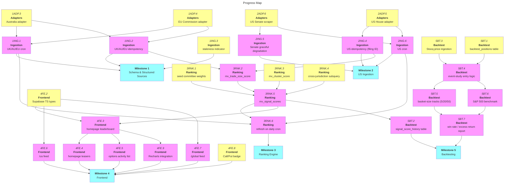

# CrossBench: MVP Roadmap

|          | Status        | Next Up                                        | Blocked                          |
| -------- | ------------- | ----------------------------------------------- | --------------------------------- |
| **SCH**  | ✅ Milestone 1 schema complete (all 5 tables pushed) | —                                | —                                  |
| **ADP**  | UK adapter complete | AU/EU/US House/US Senate adapters (unblocked) | — |
| **ING**  | Not started   | Staleness indicator (unblocked)                 | Cron/idempotency (need adapters)  |
| **RNK**  | Not started   | Seed weights, cluster score, cross-jurisdiction (unblocked) | Signal score (needs populated data) |
| **FE**   | ✅ Next.js scaffold complete | Supabase TS types, Call/Put badge (unblocked) | Data-backed pages (need RNK/TS types) |
| **BT**   | Not started   | Stooq price ingestion, backtest_positions table (unblocked) | Event-study logic (needs data) |

---

## Contents

- [Milestones](#milestones)
  - [Milestone 1: Schema & Structured Sources](#m1)
  - [Milestone 2: US Ingestion](#m2)
  - [Milestone 3: Ranking Engine](#m3)
  - [Milestone 4: Frontend](#m4)
  - [Milestone 5: Backtesting](#m5)
- [Progress Map](#map)
- [Links](#links)
- [Beyond MVP](#post-mvp)

---

## Milestones

<a name="m1"><h3>Milestone 1: Schema & Structured Sources</h3></a>

> [!IMPORTANT]
> **Goal:** Stand up the core Supabase schema and the `SourceAdapter` pattern, then ingest UK, Australia, and EU Commission disclosures — the three structured/bulk-format sources — into `disclosure_events`.

<a name="m1-doing"><h4>In Progress (Milestone 1)</h4></a>

_None._

<a name="m1-todo"><h4>To Do (Milestone 1)</h4></a>

- [ ] 1ING.3. Build "data last updated" footer indicator from `ingestion_runs`
- [ ] 1ADP.3. Build Australia adapter (register, threshold-crossing)
- [ ] 1ADP.4. Build EU Commission adapter (Commissioners' declarations ZIP)

<a name="m1-blocked"><h4>Blocked (Milestone 1)</h4></a>

- [ ] 1ING.1. Set up staggered Vercel Cron jobs (once/day) for UK/AU/EU — **depends on 1ADP.3, 1ADP.4**
- [ ] 1ING.2. Implement idempotency for AU/EU `raw_documents` (UK adapter already supplies a stable API `id` as `source_ref`; confirm whether AU/EU expose a similar stable ID or need a content hash) — **depends on 1ADP.3, 1ADP.4**

<a name="m1-done"><h4>Completed (Milestone 1)</h4></a>

- [x] 1SCH.1. Create `officials`, `committees`, `official_committee_memberships`, `committee_sector_relevance` tables
- [x] 1SCH.2. Create `securities` + `security_identifiers` tables
- [x] 1SCH.3. Create `raw_documents` staging table with `unique(source_name, source_ref)` idempotency constraint
- [x] 1SCH.4. Create `disclosure_events` canonical table
- [x] 1SCH.5. Create `ingestion_runs` table
- [x] 1ADP.1. Define common `SourceAdapter` interface (`fetch()` + `parse()`)
- [x] 1ADP.2. Build UK adapter (Parliament Interests API, Shareholdings category, threshold-crossing)

---

<a name="m2"><h3>Milestone 2: US Ingestion</h3></a>

> [!IMPORTANT]
> **Goal:** Add US House and Senate disclosures — the highest-cost, highest-fragility source tier (Senate has no official bulk API) — without blocking the three structured sources already flowing from Milestone 1.

<a name="m2-doing"><h4>In Progress (Milestone 2)</h4></a>

_None._

<a name="m2-todo"><h4>To Do (Milestone 2)</h4></a>

- [ ] 2ADP.5. Build US House adapter (bulk ZIP + PDF form parsing)
- [ ] 2ADP.6. Build US Senate eFD scraper (fragile, no bulk API — design to degrade gracefully)

<a name="m2-blocked"><h4>Blocked (Milestone 2)</h4></a>

- [ ] 2ING.4. Implement idempotency via real filing ID for US — **depends on 2ADP.5**
- [ ] 2ING.5. Graceful-degradation handling so Senate scraper failures don't block the rest of the pipeline — **depends on 2ADP.6**
- [ ] 2ING.6. Add staggered US Vercel Cron job — **depends on 2ADP.5, 2ADP.6**

<a name="m2-done"><h4>Completed (Milestone 2)</h4></a>

_None._

---

<a name="m3"><h3>Milestone 3: Ranking Engine</h3></a>

> [!IMPORTANT]
> **Goal:** Compute the notability `signal_score` (size, committee relevance, 90-day clustering, cross-jurisdiction) as materialized views refreshed on the same daily cron as ingestion.

<a name="m3-doing"><h4>In Progress (Milestone 3)</h4></a>

_None._

<a name="m3-todo"><h4>To Do (Milestone 3)</h4></a>

- [ ] 3RNK.1. Seed `committee_sector_relevance` weights
- [ ] 3RNK.3. Build `mv_cluster_score` materialized view (90-day distinct officials)
- [ ] 3RNK.4. Build cross-jurisdiction `country_count` subquery

<a name="m3-blocked"><h4>Blocked (Milestone 3)</h4></a>

- [ ] 3RNK.2. Build `mv_trade_size_score` materialized view — **depends on 1ING.2, 2ING.4**
- [ ] 3RNK.5. Build `mv_signal_scores`, combining size/committee/cluster/cross-jurisdiction at 0.30/0.25/0.25/0.20 — **depends on 3RNK.1, 3RNK.2, 3RNK.3, 3RNK.4**
- [ ] 3RNK.6. Wire materialized view refresh into the daily cron — **depends on 3RNK.5, 1ING.1, 2ING.6**

<a name="m3-done"><h4>Completed (Milestone 3)</h4></a>

_None._

---

<a name="m4"><h3>Milestone 4: Frontend</h3></a>

> [!IMPORTANT]
> **Goal:** Ship the three MVP pages (homepage, `/us`, `/global`) as Next.js Server Components reading directly from Supabase, framed as a notability signal rather than investment advice.

<a name="m4-doing"><h4>In Progress (Milestone 4)</h4></a>

_None._

<a name="m4-todo"><h4>To Do (Milestone 4)</h4></a>

- [ ] 4FE.2. Generate Supabase TypeScript types
- [ ] 4FE.8. Add ▲Call/▼Put badge component for options

<a name="m4-blocked"><h4>Blocked (Milestone 4)</h4></a>

- [ ] 4FE.3. Build homepage top-5 leaderboard from `mv_signal_scores` — **depends on 3RNK.5, 4FE.2**
- [ ] 4FE.4. Build homepage teaser panels ("US activity this week", "Notable positions — UK/AU/EU") — **depends on 4FE.3**
- [ ] 4FE.5. Build always-visible "notable options activity" homepage list — **depends on 4FE.3**
- [ ] 4FE.6. Build `/us` filterable feed (chamber, party, committee, ticker, equity/options chip) — **depends on 4FE.2**
- [ ] 4FE.7. Build `/global` feed (UK/AU/EU threshold crossings, framed as "position changes" not "trades") — **depends on 4FE.2**
- [ ] 4FE.9. Integrate Recharts (leaderboard bars, score-over-time, sector volume) — **depends on 4FE.3**

<a name="m4-done"><h4>Completed (Milestone 4)</h4></a>

- [x] 4FE.1. Scaffold Next.js (App Router) + TypeScript + Tailwind project

---

<a name="m5"><h3>Milestone 5: Backtesting</h3></a>

> [!IMPORTANT]
> **Goal:** Validate the ranking formula with a lookahead-safe event study across three basket sizes (top 5/20/50), benchmarked against the S&P 500, using free Stooq EOD price data.

<a name="m5-doing"><h4>In Progress (Milestone 5)</h4></a>

_None._

<a name="m5-todo"><h4>To Do (Milestone 5)</h4></a>

- [ ] 5BT.3. Integrate Stooq EOD CSV price ingestion (no key required)
- [ ] 5BT.1. Create `backtest_positions` table

<a name="m5-blocked"><h4>Blocked (Milestone 5)</h4></a>

- [ ] 5BT.2. Create `signal_score_history` table (append-only, `formula_version`, never recompute history) — **depends on 3RNK.5**
- [ ] 5BT.4. Implement event-study entry logic (enter at next close *after* disclosure is filed — no lookahead bias) — **depends on 5BT.1, 5BT.3**
- [ ] 5BT.5. Implement three independent basket-size tracks (top 5/20/50) — **depends on 5BT.4**
- [ ] 5BT.6. Implement S&P 500 benchmark comparison (excess return, not raw return) — **depends on 5BT.4**
- [ ] 5BT.7. Compute win rate / average excess return reporting, tagged equity vs. options-originated — **depends on 5BT.5, 5BT.6**

<a name="m5-done"><h4>Completed (Milestone 5)</h4></a>

_None._

---

<a name="map"><h2>Progress Map</h2></a>

---

<a name="links"><h2>Links</h2></a>

- [MVP Design Document](../political-disclosure-tracker-mvp-design.md)

---

<a name="post-mvp"><h2>Beyond MVP</h2></a>

Stretch goals from the design doc (§ "Stretch goals (v2+)"), not yet broken into tasks:

1. Notable-options panel on homepage (build before a full `/options` page)
2. Dedicated `/options` page with its own leaderboard
3. Official and stock profile pages (`/officials/[id]`, `/stocks/[ticker]`)
4. Policy/regulatory noise tracker (free RSS + keyword tagging, no LLM cost)
5. Germany/France/Italy tier via LLM-assisted PDF extraction (first real per-use cost — build only after the free four-source version proves the concept)
6. Empirical formula re-weighting using free Stooq EOD data once backtest history accumulates
7. Public API exposure via Supabase's auto-generated REST layer

**Also flagged, not yet actionable:**
- US commercial-use legal question (design doc § 4) — needs a real legal opinion before any monetization step.
- Australia/EU Commission licensing — not deeply verified, treat as open.
- Spain — needs a technical spike to confirm disclosure data format before committing engineering time.
