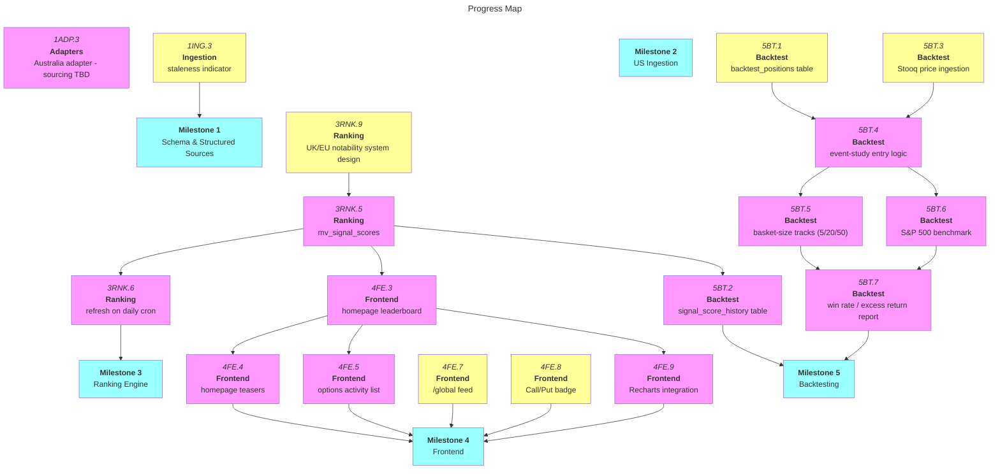

# CrossBench: MVP Roadmap

|          | Status        | Next Up                                        | Blocked                          |
| -------- | ------------- | ----------------------------------------------- | --------------------------------- |
| **SCH**  | ✅ Milestone 1 schema complete (all 5 tables pushed) | —                                | —                                  |
| **ADP**  | ✅ All in-scope adapters complete (UK, EU Commission, US House, US Senate) | — | AU deferred to Tier 3 (PDF/LLM extraction, see `1ADP.3`) |
| **ING**  | ✅ Orchestrator + idempotency + error isolation + daily Vercel Cron all live in production | Staleness indicator (unblocked) | — |
| **RNK**  | `3RNK.1`-`3RNK.4`, `3RNK.8` all done | `3RNK.9` (UK/EU notability system design) | `3RNK.5`/`3RNK.6` (need `3RNK.9` resolved, not just built) |
| **FE**   | ✅ Next.js scaffold + Supabase client/types wired + `/us` feed live | Call/Put badge, `/global` feed (unblocked) | Homepage leaderboard/teasers/Recharts (need RNK) |
| **BT**   | Not started   | Stooq price ingestion, backtest_positions table (unblocked) | Event-study logic (needs data) |

---

## Contents

- [Milestones](#milestones)
  - [Milestone 1: Schema & Structured Sources](#m1)
  - [Milestone 2: US Ingestion](#m2)
  - [Milestone 3: Ranking Engine](#m3)
  - [Milestone 4: Frontend](#m4)
  - [Milestone 5: Backtesting](#m5)
- [Progress Map](#map)
- [Links](#links)
- [Beyond MVP](#post-mvp)

---

## Milestones

<a name="m1"><h3>Milestone 1: Schema & Structured Sources</h3></a>

> [!IMPORTANT]
> **Goal:** Stand up the core Supabase schema and the `SourceAdapter` pattern, then ingest UK and EU Commission disclosures — the confirmed structured/bulk-format sources — into `disclosure_events`. Australia's status is unresolved (see `1ADP.3`).

<a name="m1-doing"><h4>In Progress (Milestone 1)</h4></a>

_None._

<a name="m1-todo"><h4>To Do (Milestone 1)</h4></a>

- [ ] 1ING.3. Build "data last updated" footer indicator from `ingestion_runs`

<a name="m1-blocked"><h4>Blocked (Milestone 1)</h4></a>

- [ ] 1ADP.3. Build Australia adapter — **reclassified from Tier 2 to Tier 3 (deferred), not a task dependency block.** The design doc's "structured register, in scope" classification was wrong: the official register (`aph.gov.au`) is per-MP PDFs, same shape as the deferred Germany/France/Italy sources. The one candidate third-party aggregator, `openpolitics.au`, requires a paid subscription to access — ruled out for MVP (free-four-source philosophy, and a third-party paid data source raises its own licensing question beyond just the access cost). Treat AU as needing LLM-assisted PDF extraction like the Tier 3 sources; revisit alongside that stretch goal, not before.

<a name="m1-done"><h4>Completed (Milestone 1)</h4></a>

- [x] 1SCH.1. Create `officials`, `committees`, `official_committee_memberships`, `committee_sector_relevance` tables
- [x] 1SCH.2. Create `securities` + `security_identifiers` tables
- [x] 1SCH.3. Create `raw_documents` staging table with `unique(source_name, source_ref)` idempotency constraint
- [x] 1SCH.4. Create `disclosure_events` canonical table
- [x] 1SCH.5. Create `ingestion_runs` table
- [x] 1ADP.1. Define common `SourceAdapter` interface (`fetch()` + `parse()`)
- [x] 1ADP.2. Build UK adapter (Parliament Interests API, Shareholdings category, threshold-crossing)
- [x] 1ADP.4. Build EU Commission adapter (Commissioners' Declarations of Interests ZIP, Section III.A.1 Shares only). Added a `currency` column to `disclosure_events` (EU figures are exact values in varying currencies — EUR, CZK confirmed — unlike UK's banded GBP-implicit thresholds). English-language declarations only (`-EN.xml`); confirmed every commissioner has one, flagged as an assumption to recheck if the source ever adds a commissioner without an EN translation.
- [x] 1ING.2. Idempotency for EU (and UK) `raw_documents` — solved generically, not per-source: `runIngestion()` (`lib/ingestion/run-source.ts`) dedupes any adapter's fetched documents against existing `raw_documents.source_ref` before insert, so this didn't need EU-specific handling. **Correction (2026-08-17):** EU's `sourceRef` still needed source-specific work — it was keyed on a snapshot date read from a `Last-Modified` header the DOI zip never actually sends, so the generic dedup never matched and every commissioner was re-inserted daily (351 duplicate `raw_documents` rows, 65 duplicate `disclosure_events`, confirmed live against production). Fixed by hashing parsed share-table content instead of a date ([PR #19](https://github.com/Oggie112/CrossBench/pull/19)); duplicates cleaned up in production down to the real 27 documents / 5 disclosures.
- [x] 1ING.1. Vercel Cron for UK/EU — **not staggered per-source as originally scoped.** One combined daily job (`vercel.json`, `0 6 * * *`) hitting `/api/ingest`, which already loops all four sources sequentially with per-source error isolation. Hobby tier only supports once/day scheduling with ±59min precision anyway, so per-source staggering wouldn't have bought real timing precision. Deployed and verified live against production.

---

<a name="m2"><h3>Milestone 2: US Ingestion</h3></a>

> [!IMPORTANT]
> **Goal:** Add US House and Senate disclosures — the highest-cost, highest-fragility source tier (Senate has no official bulk API) — without blocking the three structured sources already flowing from Milestone 1.

<a name="m2-doing"><h4>In Progress (Milestone 2)</h4></a>

_None._

<a name="m2-todo"><h4>To Do (Milestone 2)</h4></a>

_None._

<a name="m2-blocked"><h4>Blocked (Milestone 2)</h4></a>

_None._

<a name="m2-done"><h4>Completed (Milestone 2)</h4></a>

- [x] 2ADP.5. Build US House adapter (bulk ZIP index + per-filing PDF form parsing via coordinate-based table reconstruction). Covers `P`-type (Periodic Transaction Report) filings only. Verified against 295 real 2026 filings plus targeted 2024/2025 samples for options (calls and puts) and bond coverage. `SourceAdapter.fetch()` gained an optional `knownSourceRefs` parameter (non-breaking for UK/EU) so orchestration can skip re-downloading already-stored filings — this source needs one HTTP request per PDF (hundreds per run), unlike UK/EU's single-request fetches.
- [x] 2ADP.6. Build US Senate adapter — **reclassified from direct-scrape to third-party-aggregator consumption.** `efdsearch.senate.gov` runs Akamai bot protection with an adaptive/behavioral component, confirmed via direct testing: satisfying the static header requirements got 5/5 clean responses in isolation, but completing the real disclaimer→search→paginate flow triggered a block that then also degraded the previously-reliable simple requests. Two historical open-source Senate scrapers (`jeremiak/us-senate-financial-disclosure-scraper`, `timothycarambat/senate-stock-watcher-data`) both used real headless-browser automation and both went dormant years ago (2021, 2022) — unclear whether that's because bot detection tightened since, because running headless-browser infrastructure indefinitely stopped being worth the cost, or both. Considered Playwright but ruled it out given Vercel Hobby tier constraints. Consumes `kadoa-org/congress-trading-monitor`'s `trades.json` (MIT licensed, refreshed daily, no auth required) filtered to `chamber: "senate"`. Verified against all 191 real Senate records in the current snapshot — clean mapping, no thrown errors, though zero options trades exist in the sample so that mapping path is untested against real data.
- [x] 2ING.4. Idempotency via real filing ID for US — same generic `runIngestion()` dedup as `1ING.2`, keyed on House `DocID` / Senate kadoa `id` as each adapter's `source_ref`.
- [x] 2ING.5. Graceful-degradation handling — `runIngestion()` isolates errors per-document (one bad filing gets flagged via `raw_documents.processing_error`, doesn't abort the source), and `/api/ingest` runs each of the four adapters independently so one source's total failure can't block the others. Generalized to all sources, not just Senate. Caught a real instance of exactly this while testing: ~18% of US House filings were failing on a `decodeURIComponent` bug, isolated cleanly without losing the other 82%.
- [x] 2ING.6. US Vercel Cron — same combined daily job as `1ING.1`, not a separate staggered job. See that entry for reasoning.

---

<a name="m3"><h3>Milestone 3: Ranking Engine</h3></a>

> [!IMPORTANT]
> **Goal:** Compute the notability `signal_score` (size, committee relevance, 90-day clustering, cross-jurisdiction) as materialized views refreshed on the same daily cron as ingestion.

<a name="m3-doing"><h4>In Progress (Milestone 3)</h4></a>

_None._

<a name="m3-todo"><h4>To Do (Milestone 3)</h4></a>

- [ ] 3RNK.7. Decide size-signal approach for threshold-crossing disclosure types before `3RNK.5` — UK's `size_percentile` is pinned at 0 for every row (both Shareholdings bands anchor to the same £70,000 proxy, see `uk.ts`), capping UK's achievable `signal_score` at 0.70 vs 1.0+ for transaction-based sources, since the 0.30 size weight can never contribute. Root cause isn't UK-specific: any threshold-crossing register (this or a future source) reports "crossed X" rather than a transaction size, so there's no real magnitude to rank. Options: accept as documented MVP limitation; make the formula branch by `disclosure_type` so threshold-crossing types redistribute the 0.30 size weight across the other three terms instead of forcing a fake size axis; differentiate UK's two bands to at least break the internal tie (partial fix, doesn't close the cross-country ceiling gap on its own). No decision made yet. **Leaning:** branch `mv_signal_scores` by `disclosure_type` rather than treating this as UK-specific — transaction-type rows keep the size term as-is, threshold-crossing types redistribute the 0.30 weight proportionally across the other three so their ceiling stays 1.0. Tradeoff: `signal_score` becomes a `CASE`-branched formula instead of one flat expression, more SQL to maintain but honest about what each source actually measures.

  **Same tension surfaced again in `3RNK.3`'s cluster window, with a cause now confirmed rather than assumed:** the EU Code of Conduct for Commissioners requires declarations completed on taking office, revised on change, and updated at minimum annually regardless of change ([source](https://commission.europa.eu/about/service-standards-and-principles/ethics-and-good-administration/commissioners-and-ethics/code-conduct-members-european-commission_en)). All 27 commissioners' current `notification_date`s cluster within days of each other in January 2026, consistent with an annual/term-start re-certification rather than a continuous trickle — so EU will structurally spend most of the year outside any rolling 90-day window, not because of a bug, but because that's what the source's real cadence looks like. Confirmed this isn't just a hypothetical: EU's content-hash `sourceRef` (see `1ING.2` correction) only hashes the parsed share rows, deliberately excluding the `"Date:"` field, so a republished document that re-confirms unchanged holdings (e.g. a no-change annual review) won't trigger a new insert or update `notification_date` at all - we only ever record *last actual change*, never *last re-attestation*. Arguably the more correct signal for clustering purposes (a rubber-stamp re-confirmation isn't a new event worth surfacing), but it means the window is even sparser than the source's own cadence would suggest.

  **Reframing, not just a bug list:** UK and EU being lower-volatility and staler than US is expected given their nature (threshold-crossing / periodic re-certification vs. continuous transaction reporting), not a data-quality problem to normalize away. It's also arguably a feature, not just a limitation - a change in a source that rarely changes is inherently more noteworthy than the same volume of change in a source that changes constantly. Worth considering directly in whatever `3RNK.5`/`3RNK.7` formula redesign happens, not just compensated for.

  **Superseded by `3RNK.9`** (2026-08-18) — the "branch by `disclosure_type`, still emit one `signal_score`" leaning above still assumed every disclosure should land on one comparable axis. `3RNK.9` goes further: UK/EU may not need a branch of the US formula at all, but a structurally different one, related to US through shared data identity rather than a shared score. Kept here for the reasoning trail; `3RNK.9` is the live decision.

- [ ] 3RNK.9. UK/EU likely need a structurally different notability system from US, not a branched version of the same formula — reframes `3RNK.7`'s narrower "redistribute the size weight" leaning after building `3RNK.2`-`3RNK.4` surfaced the same wall three times: the formula assumes continuous, high-frequency, granular data (true for US transactions), which UK/EU's threshold-crossing / periodic-recertification registers structurally aren't and can't become through better engineering. Proposed shape for a UK/EU-appropriate system, none of it US's magnitude-percentile machinery: **(1) frequency-anomaly, not magnitude** - is filing activity spiking relative to that source's own historical baseline, rather than "how big was this compared to other filings" (fits a low-baseline source better than a high one: a source that files 4x/year jumping to 8x/month is a bigger, more detectable signal than the same absolute jump would be in US's constant churn). Not viable until more calendar history accumulates - UK currently has 4 rows total, no baseline to deviate from yet. Connects to the design doc's already-deferred "policy/regulatory noise tracker" stretch goal (correlating filing timing with bill activity), not a wholly new idea. **(2) Threshold-tier as an ordinal signal, not a fake continuous one** - `3RNK.7` treated UK's two Shareholdings bands as a failure (both tied at percentile 0); as a categorical severity tag instead ("crossed 15% company ownership" is objectively rarer than "crossed £70k") that ordering is real, usable information, just not continuous information. **(3) Committee/portfolio relevance carries over unmodified** - `committee_sector_relevance` (UK) and `portfolio_sector_relevance` (EU) from `3RNK.1` already work as real, resolved, comparable signals; no reframing needed here, worth stating as a working part, not just problems. **(4) Cross-jurisdiction overlap stays source-agnostic** - always was, since it's defined by shared `security_id` (`3RNK.8`, done), not per-source magnitude. **Relating US and UK/EU without one blended score:** the product's actual differentiator - officials in different governments independently concentrating on the same sector - is carried entirely by shared security/sector identity (already unified via the Yahoo Finance sector classification from `3RNK.1`), not by score comparability. Two structurally different formulas can genuinely relate through what they're *about* without their outputs sitting on the same numeric axis. Likely downstream consequence for `4FE.3`/`4FE.4` (homepage leaderboard/teasers): probably source-family leaderboards plus an explicit cross-jurisdiction callout, rather than one blended top-5 - a product/frontend implication of this decision, not just a formula one, flagged here since it surfaced from this discussion even though it's `4FE`'s to actually resolve.

  **Decision (2026-08-18): proceeding on this basis, grounded in a direct check rather than assumption.** Pulled UK's full 2025 Shareholdings volume from the live Parliament API (our own DB only holds a 90-day window): 15 disclosures for the entire year across all 650 MPs, 11 in the `>15% ownership` band and 4 in the `>£70k` band, zero recognisable public/listed companies - every one a private vehicle (several are personal service companies, one is a new political party's funding entity, one an anti-pylon campaign group). Confirmed the 15% figure itself against the actual UK Code of Conduct rules for MPs, not just the register's own label text. Checked EU's current 5 real holdings the same way: one (Erste Group AG) is a genuine large-cap stock actively traded on the Vienna/Prague/Bucharest exchanges; the rest are either non-tradeable cooperative bank shares, a bank only just listed on a minor secondary venue this year under a name it stopped using in 2023 (another company-name-drift wrinkle for `3RNK.8`, distinct from formatting), or a private farm. So: Shareholdings genuinely was the right category to have chosen for this product's goal - it's not a wrong pick, it's that UK MPs mostly don't appear to run active individual stock portfolios the way a meaningful share of US Congress does, which a different category choice can't fix. There remains a real but low chance of a genuine `>£70k` liquid-stock move showing up in future UK filings - not zero, worth keeping the pipeline able to catch one, just not something to design the whole system around. Proceeding on `3RNK.9`'s basis specifically because it doesn't cost anything if UK stays low-volume: under the frequency-anomaly framing (component 1 above), a quiet UK is the expected steady state, not a failure, and a genuine spike is worth surfacing on its own terms - anomalous official behaviour is the notable thing, independent of whether the specific stock involved is one a US trader would ever look twice at. Keeping the formulas separate rather than forcing one blended score means UK/EU staying low-volume doesn't degrade or distort anything on the US side either.

<a name="m3-blocked"><h4>Blocked (Milestone 3)</h4></a>

- [ ] 3RNK.5. Build `mv_signal_scores` — **depends on 3RNK.1/3RNK.2/3RNK.3/3RNK.4/3RNK.8 (all done)**, but its actual shape is now an open question, not just an implementation task: `3RNK.9` concluded UK/EU likely need a structurally different, separately-related system rather than one formula covering all three countries, which is a bigger decision than "combine size/committee/cluster/cross-jurisdiction at 0.30/0.25/0.25/0.20" as originally specced. Don't start this as a literal implementation of the original formula without resolving `3RNK.9` first.
- [ ] 3RNK.6. Wire materialized view refresh into the daily cron — **depends on 3RNK.5** (cron itself already exists — `1ING.1`/`2ING.6` — this just needs to add the refresh call to the same route)

<a name="m3-done"><h4>Completed (Milestone 3)</h4></a>

- [x] 3RNK.1. Seed `committee_sector_relevance` weights — **turned out to be a 7-step prerequisite chain, not a one-liner** (see [3RNK.1 Prerequisites](../plan/3rnk1-prerequisites.md) for the full breakdown): fixed a UK ingestion bug and a separate officials-roster gap, decided the sector taxonomy, built a Yahoo Finance sector-lookup wrapper, resolved securities identity from raw disclosure text (0 → 1,538 rows), classified securities into sectors (94.7% of equity disclosures covered), seeded `committee_sector_relevance` for all 328 UK+US committees (217 rows), and built the EU portfolio path from scratch (`portfolios`/`official_portfolios`/`portfolio_sector_relevance`, 27/27 commissioners resolved) since EU has no committee structure to seed weights against at all.
- [x] 3RNK.2. Build `mv_trade_size_score` materialized view ([PR #20](https://github.com/Oggie112/CrossBench/pull/20)) — found while building that UK's `parse()` never set `amount_min`/`amount_max` (only `value_band` text), which would have permanently pinned UK's `size_percentile` at 0 under the design doc's `coalesce(amount_max, amount_min, 0)` spec. Fixed by parsing `value_band` into `amount_min`: the monetary-floor band extracts the real £ figure via regex, the percentage-of-company band (`over 15% of issued share capital`) has no monetary equivalent so anchors to the same £70,000 floor as a deliberate, documented approximation. `amount_max` intentionally left null — both bands are open-ended floors with no real ceiling in the source. Backfilled the 4 existing UK rows. Verified live: `size_percentile` spans 0-1 for EU, 0-0.997 for US (3965 rows, ties only at the open-ended top band), UK ties at 0 since only two band types exist today — expected given the current source data, not a bug (see `3RNK.7`).
- [x] 3RNK.3. Build `mv_cluster_score` materialized view (90-day distinct officials) ([PR #21](https://github.com/Oggie112/CrossBench/pull/21)) — the design doc's spec windows on `transaction_date` alone, which only US populated (checked live: US 3996/3996, UK 0/4, EU 0/5); as written this would have silently excluded UK/EU from clustering entirely, not just under-ranked them. Fixed by windowing on `coalesce(transaction_date, notification_date, as_of_date, created_at::date)` instead. UK already had real dates in the other columns, no adapter change needed. EU had zero populated date columns at all, but the source does contain one — added `extractDeclarationDate()` (mirrors `extractFullName()`) to pull the `"Date: DD/MM/YYYY"` signature-block field into `notificationDate`; backfilled the 5 existing EU rows. Also re-ran `resolve-securities.ts` (idempotent) to resolve EU's unresolved `security_id`s, a prerequisite for the view's `group by security_id`. Verified live: UK now appears (2 securities), US as expected (400 securities, 3582 official-rows), EU correctly still absent — its real declaration dates are ~7 months old, a genuine property of the source's annual/on-change cadence per the EU Code of Conduct, not a bug (see `3RNK.7`).
- [x] 3RNK.4. Build `mv_cross_jurisdiction_score` materialized view (`count(distinct country)` per security, 90-day window) — built as its own view rather than the design doc's inline anonymous subquery, matching the `3RNK.2`/`3RNK.3` pattern. Same date-window bug as `3RNK.3`'s literal spec, same fix: `coalesce(transaction_date, notification_date, as_of_date, created_at::date)` plus `security_id is not null`. Verified live: 398 securities tracked, `max(country_count) = 1` — zero cross-country overlap currently, matching what direct inspection of UK/EU's real holdings already predicted (see `3RNK.9`'s decision note). Shipped with the known caveat logged separately as `3RNK.8` (cross-source name matching untested against a real collision) rather than solving that here - this view is correct on the data it's given, `3RNK.8` is about whether that data is complete.
- [x] 3RNK.8. Cross-source security identity matching ([PR pending]) — closed most of the way for free: `lib/securities/yahoo-finance.ts`'s `lookupByName()` (built earlier for sector lookups) was already a working name→ticker resolver, including a legal-suffix-strip-and-retry pattern proven against real EU text ("Erste Group AG" → "Erste Group" → `EBS.VI`). Wired it into `resolveSecurity()`'s existing ticker → cusip → name_alias fallback chain, gated to only fire on genuinely name-only text (UK/EU), with a defensive ≥4-letter shared-token guard against a silent identity-merge of unrelated companies. Extracted `findByIdentifier`/`insertIdentifier`/the new `lookupTickerOwner` into `lib/securities/security-identifiers.ts` (both `resolve-securities.ts` and `classify-sectors.ts` run `main()` at module scope, so a shared helper module was needed to avoid a double-execution risk). New one-off `backfill-uk-eu-security-tickers.ts` enriched the 9 pre-existing UK/EU securities in place (no merge needed, just filling in `primary_ticker`); live run: 1 enriched (`Erste Group AG` → `EBS.VI`), 8 no-coverage (private companies, correctly untouched), 0 conflicts. Verified against a real near-miss too — "Akzienbonus Phantom Shares of Erste Group AG" correctly stayed unmatched (Yahoo's own relevance filtering rejects it despite the substring overlap). Also exercised the live resolution path for real (not just the backfill) against 32 then-unresolved `disclosure_events` rows, including 2 genuine new UK filings — both correctly fell through to `name_alias` with no match (neither is a public company), no errors. `mv_cross_jurisdiction_score` refresh confirmed unaffected. Explicitly deferred, not solved here: cross-listing (same company under a different ticker per exchange — Yahoo's search response has no ISIN field to key on instead), transliteration (turned out not to be needed for the one real non-Latin-script row in production — it was a mis-extracted full sentence, not a translated name, an EU-adapter issue outside this scope), and company renames over time (e.g. "Banca Popolare di Bari" → "BdM Banca" in 2023 — not fixable by better string matching).

---

<a name="m4"><h3>Milestone 4: Frontend</h3></a>

> [!IMPORTANT]
> **Goal:** Ship the three MVP pages (homepage, `/us`, `/global`) as Next.js Server Components reading directly from Supabase, framed as a notability signal rather than investment advice.

<a name="m4-doing"><h4>In Progress (Milestone 4)</h4></a>

_None._

<a name="m4-todo"><h4>To Do (Milestone 4)</h4></a>

- [ ] 4FE.7. Build `/global` feed (UK/AU/EU threshold crossings, framed as "position changes" not "trades")
- [ ] 4FE.8. Add ▲Call/▼Put badge component for options

<a name="m4-blocked"><h4>Blocked (Milestone 4)</h4></a>

- [ ] 4FE.3. Build homepage top-5 leaderboard from `mv_signal_scores` — **depends on 3RNK.5**
- [ ] 4FE.4. Build homepage teaser panels ("US activity this week", "Notable positions — UK/AU/EU") — **depends on 4FE.3**
- [ ] 4FE.5. Build always-visible "notable options activity" homepage list — **depends on 4FE.3**
- [ ] 4FE.9. Integrate Recharts (leaderboard bars, score-over-time, sector volume) — **depends on 4FE.3**

<a name="m4-done"><h4>Completed (Milestone 4)</h4></a>

- [x] 4FE.1. Scaffold Next.js (App Router) + TypeScript + Tailwind project
- [x] 4FE.2. Generate Supabase TypeScript types and wire up typed client (`lib/supabase.ts`, publishable + secret key clients)
- [x] 4FE.6. Build `/us` feed — scoped down from the original description: only an equity/options filter is wired up (real, queryable data), not chamber/party/committee/ticker, since those need officials/securities matching which is still deferred. Sorted by `notification_date`, not `transaction_date` (often 30-45 days stale). Found and fixed two real adapter bugs while testing against live data: US House filings failing on malformed URI decoding, and US Senate options being misclassified as `other` (losing the ranking formula's 2x options multiplier).

---

<a name="m5"><h3>Milestone 5: Backtesting</h3></a>

> [!IMPORTANT]
> **Goal:** Validate the ranking formula with a lookahead-safe event study across three basket sizes (top 5/20/50), benchmarked against the S&P 500, using free Stooq EOD price data.

<a name="m5-doing"><h4>In Progress (Milestone 5)</h4></a>

_None._

<a name="m5-todo"><h4>To Do (Milestone 5)</h4></a>

- [ ] 5BT.3. Integrate Stooq EOD CSV price ingestion (no key required)
- [ ] 5BT.1. Create `backtest_positions` table

<a name="m5-blocked"><h4>Blocked (Milestone 5)</h4></a>

- [ ] 5BT.2. Create `signal_score_history` table (append-only, `formula_version`, never recompute history) — **depends on 3RNK.5**
- [ ] 5BT.4. Implement event-study entry logic (enter at next close *after* disclosure is filed — no lookahead bias) — **depends on 5BT.1, 5BT.3**
- [ ] 5BT.5. Implement three independent basket-size tracks (top 5/20/50) — **depends on 5BT.4**
- [ ] 5BT.6. Implement S&P 500 benchmark comparison (excess return, not raw return) — **depends on 5BT.4**
- [ ] 5BT.7. Compute win rate / average excess return reporting, tagged equity vs. options-originated — **depends on 5BT.5, 5BT.6**

<a name="m5-done"><h4>Completed (Milestone 5)</h4></a>

_None._

---

<a name="map"><h2>Progress Map</h2></a>

```mermaid
---
title: Progress Map
---
graph TD

1ADP.3["`*1ADP.3*<br/>**Adapters**<br/>Australia adapter - sourcing TBD`"]:::blocked

1ING.3["`*1ING.3*<br/>**Ingestion**<br/>staleness indicator`"]:::open

m1["`**Milestone 1**<br/>Schema & Structured Sources`"]:::mile
1ING.3 --> m1

m2["`**Milestone 2**<br/>US Ingestion`"]:::mile

3RNK.9["`*3RNK.9*<br/>**Ranking**<br/>UK/EU notability system design`"]:::open

3RNK.5["`*3RNK.5*<br/>**Ranking**<br/>mv_signal_scores`"]:::blocked
3RNK.9 --> 3RNK.5

3RNK.6["`*3RNK.6*<br/>**Ranking**<br/>refresh on daily cron`"]:::blocked
3RNK.5 --> 3RNK.6

m3["`**Milestone 3**<br/>Ranking Engine`"]:::mile
3RNK.6 --> m3

4FE.3["`*4FE.3*<br/>**Frontend**<br/>homepage leaderboard`"]:::blocked
3RNK.5 --> 4FE.3

4FE.4["`*4FE.4*<br/>**Frontend**<br/>homepage teasers`"]:::blocked
4FE.3 --> 4FE.4

4FE.5["`*4FE.5*<br/>**Frontend**<br/>options activity list`"]:::blocked
4FE.3 --> 4FE.5

4FE.7["`*4FE.7*<br/>**Frontend**<br/>/global feed`"]:::open

4FE.8["`*4FE.8*<br/>**Frontend**<br/>Call/Put badge`"]:::open

4FE.9["`*4FE.9*<br/>**Frontend**<br/>Recharts integration`"]:::blocked
4FE.3 --> 4FE.9

m4["`**Milestone 4**<br/>Frontend`"]:::mile
4FE.4 --> m4
4FE.5 --> m4
4FE.7 --> m4
4FE.8 --> m4
4FE.9 --> m4

5BT.3["`*5BT.3*<br/>**Backtest**<br/>Stooq price ingestion`"]:::open

5BT.1["`*5BT.1*<br/>**Backtest**<br/>backtest_positions table`"]:::open

5BT.2["`*5BT.2*<br/>**Backtest**<br/>signal_score_history table`"]:::blocked
3RNK.5 --> 5BT.2

5BT.4["`*5BT.4*<br/>**Backtest**<br/>event-study entry logic`"]:::blocked
5BT.1 --> 5BT.4
5BT.3 --> 5BT.4

5BT.5["`*5BT.5*<br/>**Backtest**<br/>basket-size tracks (5/20/50)`"]:::blocked
5BT.4 --> 5BT.5

5BT.6["`*5BT.6*<br/>**Backtest**<br/>S&P 500 benchmark`"]:::blocked
5BT.4 --> 5BT.6

5BT.7["`*5BT.7*<br/>**Backtest**<br/>win rate / excess return report`"]:::blocked
5BT.5 --> 5BT.7
5BT.6 --> 5BT.7

m5["`**Milestone 5**<br/>Backtesting`"]:::mile
5BT.2 --> m5
5BT.7 --> m5

classDef blocked fill:#f9f;
classDef open fill:#ff9;
classDef mile fill:#9ff;
```

---

<a name="links"><h2>Links</h2></a>

- [MVP Design Document](../political-disclosure-tracker-mvp-design.md)
- [3RNK.1 Prerequisites Plan](../plan/3rnk1-prerequisites.md)

---

<a name="post-mvp"><h2>Beyond MVP</h2></a>

Stretch goals from the design doc (§ "Stretch goals (v2+)"), not yet broken into tasks:

1. Notable-options panel on homepage (build before a full `/options` page)
2. Dedicated `/options` page with its own leaderboard
3. Official and stock profile pages (`/officials/[id]`, `/stocks/[ticker]`)
4. Policy/regulatory noise tracker (free RSS + keyword tagging, no LLM cost)
5. Germany/France/Italy **+ Australia** tier via LLM-assisted PDF extraction (first real per-use cost — build only after the free four-source version proves the concept). AU joined this tier after investigation found no free structured source — see `1ADP.3`.
6. Empirical formula re-weighting using free Stooq EOD data once backtest history accumulates
7. Public API exposure via Supabase's auto-generated REST layer
8. UK lobbying/gifts oversight tracker, using categories the Parliament Interests API already exposes but the current adapter ignores — Gifts/hospitality from UK and non-UK sources, Family members engaged in third-party lobbying, Land and property (full list confirmed live: 11 categories total, only `Shareholdings` currently ingested). Distinct from stretch goal 4's external RSS/bill-correlation idea - this reuses the same already-integrated API and adapter shape, just different category IDs, no new source. Surfaced from `3RNK.9`'s finding that Shareholdings itself carries little market-notability signal for UK (2025: 15 disclosures all year, zero public stocks) — this would be a genuinely different UK-specific oversight product (who's receiving what from whom) rather than an attempt to extract more stock-notability signal from a register that structurally doesn't have much to give.

**Also flagged, not yet actionable:**
- US commercial-use legal question (design doc § 4) — needs a real legal opinion before any monetization step.
- Australia/EU Commission licensing — not deeply verified, treat as open.
- Spain — needs a technical spike to confirm disclosure data format before committing engineering time.
