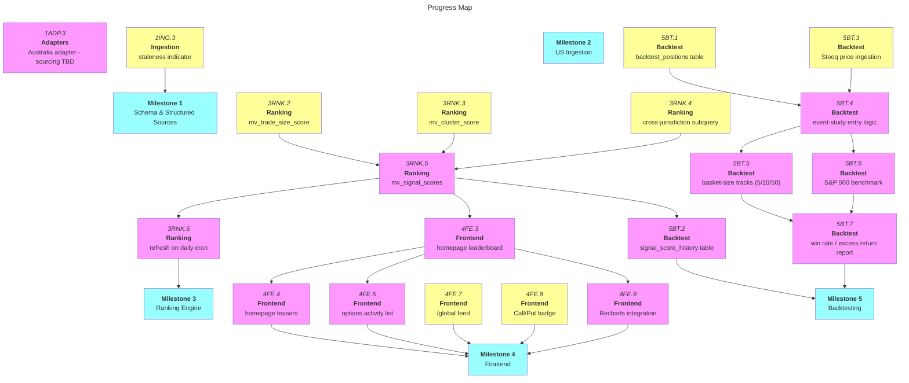

# CrossBench: MVP Roadmap

|          | Status        | Next Up                                        | Blocked                          |
| -------- | ------------- | ----------------------------------------------- | --------------------------------- |
| **SCH**  | ✅ Milestone 1 schema complete (all 5 tables pushed) | —                                | —                                  |
| **ADP**  | ✅ All in-scope adapters complete (UK, EU Commission, US House, US Senate) | — | AU deferred to Tier 3 (PDF/LLM extraction, see `1ADP.3`) |
| **ING**  | ✅ Orchestrator + idempotency + error isolation + daily Vercel Cron all live in production | Staleness indicator (unblocked) | — |
| **RNK**  | `3RNK.1` done (see [3RNK.1 Prerequisites](../plan/3rnk1-prerequisites.md)), rest not started | `mv_trade_size_score`, cluster score, cross-jurisdiction (all unblocked — real data now exists) | — |
| **FE**   | ✅ Next.js scaffold + Supabase client/types wired + `/us` feed live | Call/Put badge, `/global` feed (unblocked) | Homepage leaderboard/teasers/Recharts (need RNK) |
| **BT**   | Not started   | Stooq price ingestion, backtest_positions table (unblocked) | Event-study logic (needs data) |

---

## Contents

- [Milestones](#milestones)
  - [Milestone 1: Schema & Structured Sources](#m1)
  - [Milestone 2: US Ingestion](#m2)
  - [Milestone 3: Ranking Engine](#m3)
  - [Milestone 4: Frontend](#m4)
  - [Milestone 5: Backtesting](#m5)
- [Progress Map](#map)
- [Links](#links)
- [Beyond MVP](#post-mvp)

---

## Milestones

<a name="m1"><h3>Milestone 1: Schema & Structured Sources</h3></a>

> [!IMPORTANT]
> **Goal:** Stand up the core Supabase schema and the `SourceAdapter` pattern, then ingest UK and EU Commission disclosures — the confirmed structured/bulk-format sources — into `disclosure_events`. Australia's status is unresolved (see `1ADP.3`).

<a name="m1-doing"><h4>In Progress (Milestone 1)</h4></a>

_None._

<a name="m1-todo"><h4>To Do (Milestone 1)</h4></a>

- [ ] 1ING.3. Build "data last updated" footer indicator from `ingestion_runs`

<a name="m1-blocked"><h4>Blocked (Milestone 1)</h4></a>

- [ ] 1ADP.3. Build Australia adapter — **reclassified from Tier 2 to Tier 3 (deferred), not a task dependency block.** The design doc's "structured register, in scope" classification was wrong: the official register (`aph.gov.au`) is per-MP PDFs, same shape as the deferred Germany/France/Italy sources. The one candidate third-party aggregator, `openpolitics.au`, requires a paid subscription to access — ruled out for MVP (free-four-source philosophy, and a third-party paid data source raises its own licensing question beyond just the access cost). Treat AU as needing LLM-assisted PDF extraction like the Tier 3 sources; revisit alongside that stretch goal, not before.

<a name="m1-done"><h4>Completed (Milestone 1)</h4></a>

- [x] 1SCH.1. Create `officials`, `committees`, `official_committee_memberships`, `committee_sector_relevance` tables
- [x] 1SCH.2. Create `securities` + `security_identifiers` tables
- [x] 1SCH.3. Create `raw_documents` staging table with `unique(source_name, source_ref)` idempotency constraint
- [x] 1SCH.4. Create `disclosure_events` canonical table
- [x] 1SCH.5. Create `ingestion_runs` table
- [x] 1ADP.1. Define common `SourceAdapter` interface (`fetch()` + `parse()`)
- [x] 1ADP.2. Build UK adapter (Parliament Interests API, Shareholdings category, threshold-crossing)
- [x] 1ADP.4. Build EU Commission adapter (Commissioners' Declarations of Interests ZIP, Section III.A.1 Shares only). Added a `currency` column to `disclosure_events` (EU figures are exact values in varying currencies — EUR, CZK confirmed — unlike UK's banded GBP-implicit thresholds). English-language declarations only (`-EN.xml`); confirmed every commissioner has one, flagged as an assumption to recheck if the source ever adds a commissioner without an EN translation.
- [x] 1ING.2. Idempotency for EU (and UK) `raw_documents` — solved generically, not per-source: `runIngestion()` (`lib/ingestion/run-source.ts`) dedupes any adapter's fetched documents against existing `raw_documents.source_ref` before insert, so this didn't need EU-specific handling.
- [x] 1ING.1. Vercel Cron for UK/EU — **not staggered per-source as originally scoped.** One combined daily job (`vercel.json`, `0 6 * * *`) hitting `/api/ingest`, which already loops all four sources sequentially with per-source error isolation. Hobby tier only supports once/day scheduling with ±59min precision anyway, so per-source staggering wouldn't have bought real timing precision. Deployed and verified live against production.

---

<a name="m2"><h3>Milestone 2: US Ingestion</h3></a>

> [!IMPORTANT]
> **Goal:** Add US House and Senate disclosures — the highest-cost, highest-fragility source tier (Senate has no official bulk API) — without blocking the three structured sources already flowing from Milestone 1.

<a name="m2-doing"><h4>In Progress (Milestone 2)</h4></a>

_None._

<a name="m2-todo"><h4>To Do (Milestone 2)</h4></a>

_None._

<a name="m2-blocked"><h4>Blocked (Milestone 2)</h4></a>

_None._

<a name="m2-done"><h4>Completed (Milestone 2)</h4></a>

- [x] 2ADP.5. Build US House adapter (bulk ZIP index + per-filing PDF form parsing via coordinate-based table reconstruction). Covers `P`-type (Periodic Transaction Report) filings only. Verified against 295 real 2026 filings plus targeted 2024/2025 samples for options (calls and puts) and bond coverage. `SourceAdapter.fetch()` gained an optional `knownSourceRefs` parameter (non-breaking for UK/EU) so orchestration can skip re-downloading already-stored filings — this source needs one HTTP request per PDF (hundreds per run), unlike UK/EU's single-request fetches.
- [x] 2ADP.6. Build US Senate adapter — **reclassified from direct-scrape to third-party-aggregator consumption.** `efdsearch.senate.gov` runs Akamai bot protection with an adaptive/behavioral component, confirmed via direct testing: satisfying the static header requirements got 5/5 clean responses in isolation, but completing the real disclaimer→search→paginate flow triggered a block that then also degraded the previously-reliable simple requests. Two historical open-source Senate scrapers (`jeremiak/us-senate-financial-disclosure-scraper`, `timothycarambat/senate-stock-watcher-data`) both used real headless-browser automation and both went dormant years ago (2021, 2022) — unclear whether that's because bot detection tightened since, because running headless-browser infrastructure indefinitely stopped being worth the cost, or both. Considered Playwright but ruled it out given Vercel Hobby tier constraints. Consumes `kadoa-org/congress-trading-monitor`'s `trades.json` (MIT licensed, refreshed daily, no auth required) filtered to `chamber: "senate"`. Verified against all 191 real Senate records in the current snapshot — clean mapping, no thrown errors, though zero options trades exist in the sample so that mapping path is untested against real data.
- [x] 2ING.4. Idempotency via real filing ID for US — same generic `runIngestion()` dedup as `1ING.2`, keyed on House `DocID` / Senate kadoa `id` as each adapter's `source_ref`.
- [x] 2ING.5. Graceful-degradation handling — `runIngestion()` isolates errors per-document (one bad filing gets flagged via `raw_documents.processing_error`, doesn't abort the source), and `/api/ingest` runs each of the four adapters independently so one source's total failure can't block the others. Generalized to all sources, not just Senate. Caught a real instance of exactly this while testing: ~18% of US House filings were failing on a `decodeURIComponent` bug, isolated cleanly without losing the other 82%.
- [x] 2ING.6. US Vercel Cron — same combined daily job as `1ING.1`, not a separate staggered job. See that entry for reasoning.

---

<a name="m3"><h3>Milestone 3: Ranking Engine</h3></a>

> [!IMPORTANT]
> **Goal:** Compute the notability `signal_score` (size, committee relevance, 90-day clustering, cross-jurisdiction) as materialized views refreshed on the same daily cron as ingestion.

<a name="m3-doing"><h4>In Progress (Milestone 3)</h4></a>

_None._

<a name="m3-todo"><h4>To Do (Milestone 3)</h4></a>

- [ ] 3RNK.2. Build `mv_trade_size_score` materialized view — unblocked now that `1ING.2`/`2ING.4` (idempotency) are done and real disclosure data exists
- [ ] 3RNK.3. Build `mv_cluster_score` materialized view (90-day distinct officials)
- [ ] 3RNK.4. Build cross-jurisdiction `country_count` subquery

<a name="m3-blocked"><h4>Blocked (Milestone 3)</h4></a>

- [ ] 3RNK.5. Build `mv_signal_scores`, combining size/committee/cluster/cross-jurisdiction at 0.30/0.25/0.25/0.20 — **depends on 3RNK.1 (done), 3RNK.2, 3RNK.3, 3RNK.4**
- [ ] 3RNK.6. Wire materialized view refresh into the daily cron — **depends on 3RNK.5** (cron itself already exists — `1ING.1`/`2ING.6` — this just needs to add the refresh call to the same route)

<a name="m3-done"><h4>Completed (Milestone 3)</h4></a>

- [x] 3RNK.1. Seed `committee_sector_relevance` weights — **turned out to be a 7-step prerequisite chain, not a one-liner** (see [3RNK.1 Prerequisites](../plan/3rnk1-prerequisites.md) for the full breakdown): fixed a UK ingestion bug and a separate officials-roster gap, decided the sector taxonomy, built a Yahoo Finance sector-lookup wrapper, resolved securities identity from raw disclosure text (0 → 1,538 rows), classified securities into sectors (94.7% of equity disclosures covered), seeded `committee_sector_relevance` for all 328 UK+US committees (217 rows), and built the EU portfolio path from scratch (`portfolios`/`official_portfolios`/`portfolio_sector_relevance`, 27/27 commissioners resolved) since EU has no committee structure to seed weights against at all.

---

<a name="m4"><h3>Milestone 4: Frontend</h3></a>

> [!IMPORTANT]
> **Goal:** Ship the three MVP pages (homepage, `/us`, `/global`) as Next.js Server Components reading directly from Supabase, framed as a notability signal rather than investment advice.

<a name="m4-doing"><h4>In Progress (Milestone 4)</h4></a>

_None._

<a name="m4-todo"><h4>To Do (Milestone 4)</h4></a>

- [ ] 4FE.7. Build `/global` feed (UK/AU/EU threshold crossings, framed as "position changes" not "trades")
- [ ] 4FE.8. Add ▲Call/▼Put badge component for options

<a name="m4-blocked"><h4>Blocked (Milestone 4)</h4></a>

- [ ] 4FE.3. Build homepage top-5 leaderboard from `mv_signal_scores` — **depends on 3RNK.5**
- [ ] 4FE.4. Build homepage teaser panels ("US activity this week", "Notable positions — UK/AU/EU") — **depends on 4FE.3**
- [ ] 4FE.5. Build always-visible "notable options activity" homepage list — **depends on 4FE.3**
- [ ] 4FE.9. Integrate Recharts (leaderboard bars, score-over-time, sector volume) — **depends on 4FE.3**

<a name="m4-done"><h4>Completed (Milestone 4)</h4></a>

- [x] 4FE.1. Scaffold Next.js (App Router) + TypeScript + Tailwind project
- [x] 4FE.2. Generate Supabase TypeScript types and wire up typed client (`lib/supabase.ts`, publishable + secret key clients)
- [x] 4FE.6. Build `/us` feed — scoped down from the original description: only an equity/options filter is wired up (real, queryable data), not chamber/party/committee/ticker, since those need officials/securities matching which is still deferred. Sorted by `notification_date`, not `transaction_date` (often 30-45 days stale). Found and fixed two real adapter bugs while testing against live data: US House filings failing on malformed URI decoding, and US Senate options being misclassified as `other` (losing the ranking formula's 2x options multiplier).

---

<a name="m5"><h3>Milestone 5: Backtesting</h3></a>

> [!IMPORTANT]
> **Goal:** Validate the ranking formula with a lookahead-safe event study across three basket sizes (top 5/20/50), benchmarked against the S&P 500, using free Stooq EOD price data.

<a name="m5-doing"><h4>In Progress (Milestone 5)</h4></a>

_None._

<a name="m5-todo"><h4>To Do (Milestone 5)</h4></a>

- [ ] 5BT.3. Integrate Stooq EOD CSV price ingestion (no key required)
- [ ] 5BT.1. Create `backtest_positions` table

<a name="m5-blocked"><h4>Blocked (Milestone 5)</h4></a>

- [ ] 5BT.2. Create `signal_score_history` table (append-only, `formula_version`, never recompute history) — **depends on 3RNK.5**
- [ ] 5BT.4. Implement event-study entry logic (enter at next close *after* disclosure is filed — no lookahead bias) — **depends on 5BT.1, 5BT.3**
- [ ] 5BT.5. Implement three independent basket-size tracks (top 5/20/50) — **depends on 5BT.4**
- [ ] 5BT.6. Implement S&P 500 benchmark comparison (excess return, not raw return) — **depends on 5BT.4**
- [ ] 5BT.7. Compute win rate / average excess return reporting, tagged equity vs. options-originated — **depends on 5BT.5, 5BT.6**

<a name="m5-done"><h4>Completed (Milestone 5)</h4></a>

_None._

---

<a name="map"><h2>Progress Map</h2></a>

```mermaid
---
title: Progress Map
---
graph TD

1ADP.3["`*1ADP.3*<br/>**Adapters**<br/>Australia adapter - sourcing TBD`"]:::blocked

1ING.3["`*1ING.3*<br/>**Ingestion**<br/>staleness indicator`"]:::open

m1["`**Milestone 1**<br/>Schema & Structured Sources`"]:::mile
1ING.3 --> m1

m2["`**Milestone 2**<br/>US Ingestion`"]:::mile

3RNK.2["`*3RNK.2*<br/>**Ranking**<br/>mv_trade_size_score`"]:::open

3RNK.3["`*3RNK.3*<br/>**Ranking**<br/>mv_cluster_score`"]:::open

3RNK.4["`*3RNK.4*<br/>**Ranking**<br/>cross-jurisdiction subquery`"]:::open

3RNK.5["`*3RNK.5*<br/>**Ranking**<br/>mv_signal_scores`"]:::blocked
3RNK.2 --> 3RNK.5
3RNK.3 --> 3RNK.5
3RNK.4 --> 3RNK.5

3RNK.6["`*3RNK.6*<br/>**Ranking**<br/>refresh on daily cron`"]:::blocked
3RNK.5 --> 3RNK.6

m3["`**Milestone 3**<br/>Ranking Engine`"]:::mile
3RNK.6 --> m3

4FE.3["`*4FE.3*<br/>**Frontend**<br/>homepage leaderboard`"]:::blocked
3RNK.5 --> 4FE.3

4FE.4["`*4FE.4*<br/>**Frontend**<br/>homepage teasers`"]:::blocked
4FE.3 --> 4FE.4

4FE.5["`*4FE.5*<br/>**Frontend**<br/>options activity list`"]:::blocked
4FE.3 --> 4FE.5

4FE.7["`*4FE.7*<br/>**Frontend**<br/>/global feed`"]:::open

4FE.8["`*4FE.8*<br/>**Frontend**<br/>Call/Put badge`"]:::open

4FE.9["`*4FE.9*<br/>**Frontend**<br/>Recharts integration`"]:::blocked
4FE.3 --> 4FE.9

m4["`**Milestone 4**<br/>Frontend`"]:::mile
4FE.4 --> m4
4FE.5 --> m4
4FE.7 --> m4
4FE.8 --> m4
4FE.9 --> m4

5BT.3["`*5BT.3*<br/>**Backtest**<br/>Stooq price ingestion`"]:::open

5BT.1["`*5BT.1*<br/>**Backtest**<br/>backtest_positions table`"]:::open

5BT.2["`*5BT.2*<br/>**Backtest**<br/>signal_score_history table`"]:::blocked
3RNK.5 --> 5BT.2

5BT.4["`*5BT.4*<br/>**Backtest**<br/>event-study entry logic`"]:::blocked
5BT.1 --> 5BT.4
5BT.3 --> 5BT.4

5BT.5["`*5BT.5*<br/>**Backtest**<br/>basket-size tracks (5/20/50)`"]:::blocked
5BT.4 --> 5BT.5

5BT.6["`*5BT.6*<br/>**Backtest**<br/>S&P 500 benchmark`"]:::blocked
5BT.4 --> 5BT.6

5BT.7["`*5BT.7*<br/>**Backtest**<br/>win rate / excess return report`"]:::blocked
5BT.5 --> 5BT.7
5BT.6 --> 5BT.7

m5["`**Milestone 5**<br/>Backtesting`"]:::mile
5BT.2 --> m5
5BT.7 --> m5

classDef blocked fill:#f9f;
classDef open fill:#ff9;
classDef mile fill:#9ff;
```

---

<a name="links"><h2>Links</h2></a>

- [MVP Design Document](../political-disclosure-tracker-mvp-design.md)
- [3RNK.1 Prerequisites Plan](../plan/3rnk1-prerequisites.md)

---

<a name="post-mvp"><h2>Beyond MVP</h2></a>

Stretch goals from the design doc (§ "Stretch goals (v2+)"), not yet broken into tasks:

1. Notable-options panel on homepage (build before a full `/options` page)
2. Dedicated `/options` page with its own leaderboard
3. Official and stock profile pages (`/officials/[id]`, `/stocks/[ticker]`)
4. Policy/regulatory noise tracker (free RSS + keyword tagging, no LLM cost)
5. Germany/France/Italy **+ Australia** tier via LLM-assisted PDF extraction (first real per-use cost — build only after the free four-source version proves the concept). AU joined this tier after investigation found no free structured source — see `1ADP.3`.
6. Empirical formula re-weighting using free Stooq EOD data once backtest history accumulates
7. Public API exposure via Supabase's auto-generated REST layer

**Also flagged, not yet actionable:**
- US commercial-use legal question (design doc § 4) — needs a real legal opinion before any monetization step.
- Australia/EU Commission licensing — not deeply verified, treat as open.
- Spain — needs a technical spike to confirm disclosure data format before committing engineering time.
